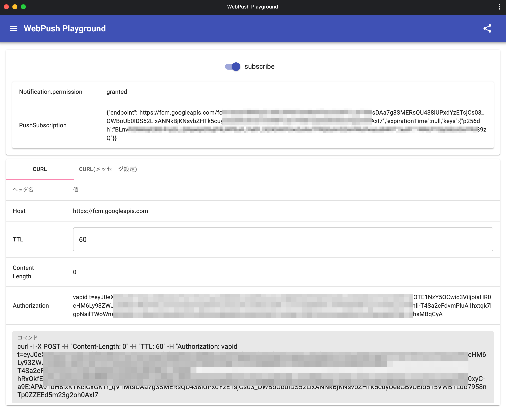

WebPush Playground
=====



概要
-----

WebPushを体験するためのアプリケーションです

URL
-----

[https://webpush-playground.firebaseapp.com](https://webpush-playground.firebaseapp.com)

使用方法
-----

### CURL

1. 画面上で`subscribe`をオンにします
2. 発行されたcurlコマンドをターミナルで実行します
3. `Hello`という通知が届きます

### CURL(メッセージ指定)

1. 画面上で`subscribe`をオンにします
2. 任意のメッセージを入力します
3. テキストボックスの右側にあるダウンロードボタンを押下します
4. 3をダウンロードしたディレクトリに移動し、curlコマンドを実行します
5. 2で入力した通知が届きます

ローカル開発
-----

セキュリティ等は深く考慮していないため、ローカルでの検証用途に限りお使いください

```
$ yarn
$ yarn start
```

